- 👋 Hi, I’m TCL.
- 👀 I'm now studying at Tsinghua University.
- 🌱 I'm from the Department of Electronic Engineering.
- ❤️ I was the director of Tsinghua University EE Software Center (EESC) from 2023 to 2024.
- 💕 I was the PRESIDENT of [E.E. Student Association of Science and Technology, Tsinghua University](https://github.com/eesast) from 2023 to 2024.

### University

### Languages

<!-- Verilog doesn't has its own icon now, use velog's instead -->

||Languages|
|:---:|:---:|
|Accustomed||
|Currently Used||
|Others| |

### Working with

 

### Operating Systems

### Researching on

<!---
TCL606/TCL606 is a ✨ special ✨ repository because its `README.md` (this file) appears on your GitHub profile.
You can click the Preview link to take a look at your changes.
--->
